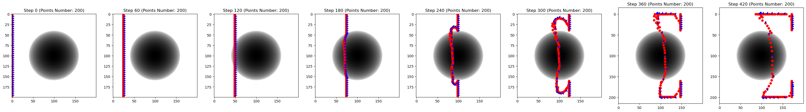
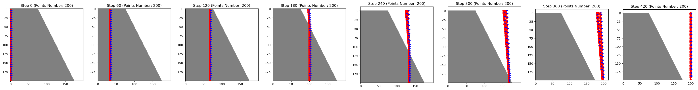
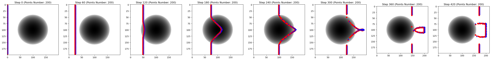
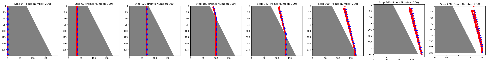

0. Could I record the meeting for study review?

1. 
```py
grad_x_ior, grad_y_ior = compute_gradients(IOR)
nx = grad_x_ior[int(y), int(x)]
ny = grad_y_ior[int(y), int(x)]
```


```py
# 1. Plus gradient
new_vx = vx + delta_t * (nx / n)
new_vy = vy + delta_t * (ny / n)
# In concave len test, the wavefront spread slower in black area (lower IOR), which seems incorrect.
```
  
  


```py
# 2. Minus gradient
new_vx = vx - delta_t * (nx / n)
new_vy = vy - delta_t * (ny / n)
# In slope test, the incidence angle is smaller than refraction angle, with light moving from a lower IOR to a higher IOR, which seems to violate Snell law.
```
  
  


Which one is correct?


2. Adaptive wavefront refinement
